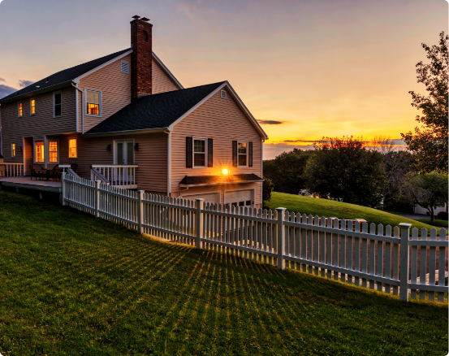
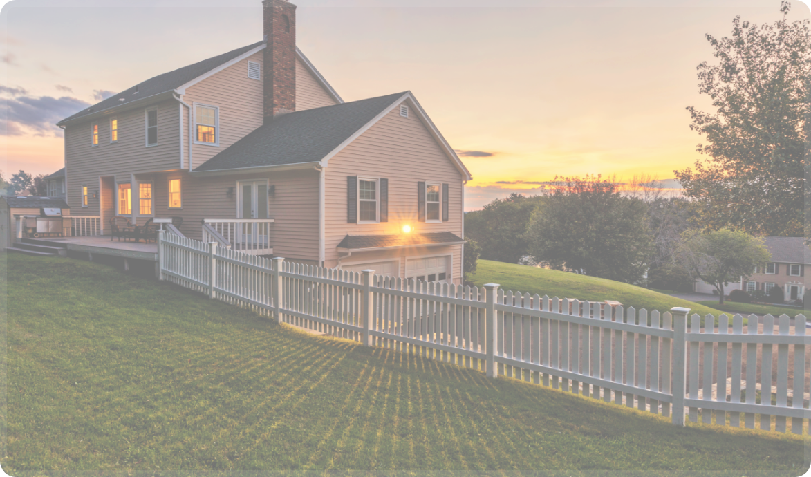

<!doctype html>
<html lang="en">

<head>
    <title>Uk</title>
    <!-- Required meta tags -->
    <meta charset="utf-8">
    <meta name="viewport" content="width=device-width, initial-scale=1, shrink-to-fit=no">
    <link rel="stylesheet" href="css/global.css">
    <link rel="stylesheet" href="css/main.css">
    <link rel="stylesheet" media="(max-width:768px)" href="css/mobile.css">

</head>

<body>

    <Header class="Header">
        

            
            

            

            

            

            

            

            

            

            

        

        

           
            <!--  -->

        

    </Header>

    <section class="Overview">
        

            
Property

            
Overview

            

                Lorem ipsum dolor sit amet, consectetur adipiscing elit. Vestibulum laoreet non leo
                et imperdiet. Morbi sed dictum diam. Cras nisi justo, malesuada et placerat ac, rutrum sed nibh.
                Maecenas sed magna a nisl
                vehicula vehicula nec quis augue. Maecenas et posuere lacus. Sed scelerisque iaculis ex quis imperdiet.
                Nunc
                molestie elit et augue viverra, at iaculis quam consequat. Curabitur volutpat malesuada nulla.
                Etiam placerat, lectus at mollis vulputate, massa ante rhoncus ligula, quis pretium odio neque quis
                justo. Lorem ipsum dolor sit amet, consectetur adipiscing elit. Vestibulum laoreet non leo
                et imperdiet. Morbi sed dictum diam. Cras nisi justo, malesuada et placerat ac, rutrum sed nibh.
                Maecenas sed magna a nisl
                vehicula vehicula nec quis augue. Maecenas et posuere lacus. Sed scelerisque iaculis ex quis imperdiet.
                Nunc
                molestie elit et augue viverra, at iaculis quam consequat. Curabitur volutpat malesuada nulla.
                Etiam placerat, lectus at mollis vulputate, massa ante rhoncus ligula, quis pretium odio neque quis
                justo.
            

            

                <button class="overview-btn bg-white">Read More</button>
            

        

    </section>

    <section class="Banner">
        
    </section>

    <section class="content-size">
        

            

                
                

                    <button class="properties-button-1"></button>
                    
Pdf Document link…

                    <button class="properties-button-2"></button>
                

            

            

                
Property

                
Comparable

                
Properties

                

                    Lorem Ipsum is simply dummy text of the printing
                    and typesetting industry. Lorem Ipsum has been the industry’s standard dummy
                    text ever since the 1500s, when an unknown
                    printer took a galley of type and scrambled it to make a type
                    Lorem Ipsum is simply dummy text of the printing
                    and typesetting industry. Lorem Ipsum has been the industry’s standard dummy
                    text ever since the 1500s, when an unknown
                    printer took a galley of type and scrambled it a galley .
                

                <button class="properti-btn-1 bg-white">Read More </button>

                

                

            

        

        

            <button class="circle properties-btn-1">←</button>
            <button class="circle properties-btn-2">→</button>
        

    </section>

    <section class="Plan-price ">
        

            

                

                    
Property

                    
Marketing

                    
Plan & Price

                    

                        Sed a tempor urna. Aenean a turpis posuere, rhoncus arcu vitae, venenatis
                        orci. Curabitur id tellus sed odio convallis dapibus pulvinar tristique ligula. Integer et nisi
                        commodo, pretium ex vitae, pellentesque risus. Nullam ut mauris vestibulum, vestibulum nibh vel,
                        pharetra nunc. Cras at luctus est, quis mollis quam. Donec lobortis mollis mauris at convallis.
                        Vestibulum mattis, lorem a tincidunt malesuada, magna ipsum pellentesque erat, eget mattis
                        libero tellus nec nulla. Sed a tempor urna. Aenean a turpis posuere, rhoncus arcu vitae,
                        venenatis
                        orci. Curabitur id tellus sed odio convallis dapibus pulvinar tristique ligula. Integer et nisi
                        commodo, pretium ex vitae, pellentesque risus. Nullam ut mauris vestibulum, vestibulum nibh vel,
                        pharetra nunc. Cras at luctus est, quis mollis quam. Donec lobortis mollis mauris at convallis.
                        Vestibulum mattis, lorem a tincidunt malesuada, magna ipsum pellentesque erat, eget mattis
                        libero tellus nec nulla.
                        Sed a tempor urna. Aenean a turpis posuere, rhoncus arcu vitae, venenatis
                        orci. Curabitur id tellus sed odio convallis dapibus pulvinar tristique ligula. Integer et nisi
                        commodo, pretium ex vitae, pellentesque risus. Nullam ut mauris vestibulum, vestibulum nibh vel,
                        pharetra nunc. Cras at luctus est, quis mollis quam. Donec lobortis mollis mauris at convallis.
                        Vestibulum mattis, lorem a tincidunt malesuada, magna ipsum pellentesque erat, eget mattis
                        libero tellus nec nulla.
                        Sed a tempor urna. Aenean a turpis posuere, rhoncus arcu vitae, venenatis
                        orci. Curabitur id tellus sed odio convallis dapibus pulvinar tristique ligula. Integer et nisi
                        commodo, pretium ex vitae, pellentesque risus. Nullam ut mauris vestibulum, vestibulum nibh vel,
                        pharetra nunc. Cras at luctus est, quis mollis quam. Donec lobortis mollis mauris at convallis.
                        Vestibulum mattis, lorem a tincidunt malesuada, magna ipsum pellentesque erat, eget mattis
                        libero tellus nec nulla.
                    

                    <button class="price-button">Read more </button>
                

                

                    

                        

                            

                                

                                    <button class="circle  circle-stil"></button>
                                

                                

                                    
Minimum

                                    
£ 1,450,000

                                

                            

                        

                        

                            

                                

                                    <button class="circle  circle-stil bg-primary"></button>
                                

                                

                                    
Minimum

                                    
£ 1,450,000

                                

                            

                        

                        

                            

                                

                                    <button class="circle  circle-stil bg-primary"></button>
                                

                                

                                    
Minimum

                                    
£ 1,450,000

                                

                            

                        

                    

                

            

            

                
            

        

    </section>

    <section class="Questions">
        

            <!-- 
 -->
            
Property

            
Frequently Asked

            
Questions

            <!-- 
 -->
        

        

        

            

                <button class="circle circle-style">1</button>
            

            

                
I Want to use you but another agent has quoted me a cheaper fee. What shall I
                    do?

                
You may find a cheaper fee elsewhere, but we believe we are offering a
                    better
                    service and better value than any of our competitors. We are currently rated
                    in the top 10 of all agents in the UK for customer service on 

            

        

        

        

            

                <button class="circle circle-style-1">2</button>
            

            

                
I Want to use you but another agent has quoted me a cheaper fee. What shall I
                    do?

                
Valuations are subjective, they’re not an exact science, and so it is
                    natural that opinions will differ.
                    When valuing, our job is to give you an evidence-based estimate of the valuation range but if you
                    want your 

            

        

        

        

            <button class="Question-button">Ask A Qestion </button>
        

    </section>

    <section class="Bottom-section">
        

            

                
                

                    <button class="white-button ">Reviews</button>
                    <button class="home-yellow-button "><b>Lifesycle TV Video</b></button>
                

            

        

    </section>

    <section class="bg-primary">
        

            

                
Property

                
Next Steps

                

                    If you would like Outlook to market your property simply click the PROCEED button below and we will
                    contact you to make the necessary arrangements.
                

                <button class="home-bottom-1-button"> Proceed</button>
            

            

                

                    

                        <button></button>
                    

                    

                        

                            
Length Of Agreement: 4

                            
 <b>Plan Of Action:</b>
                                Our fee is inclusive of TV
                                style video, professional
                                photography, floorplan
                                and EPC.

                            
Fee Quote: 0.75% + VAT

                        

                    

                

            

        

    </section>

    <Footer class="Footer">
        

            
            

                <h6>Phone</h6>
                
020 8558 9900

            

            
            

                <h6>Mail</h6>
                
info@lifesycle.co.uk

            

            
            

                <h6>Adres</h6>
                
London/England

            

        

    </Footer>

</body>

</html>